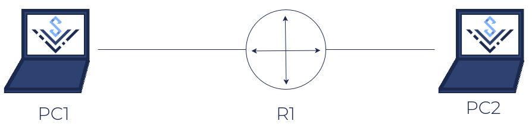

# Kurs DevOps Wakacyjnego Wyzwania KN Solvro 2026 - Lista 2

> [!WARNING]
> Przed podejściem do wykonania zadań upewnij się, że masz najnowszą wersję `tools/netns.sh`!
>
> Skrypt został zaktualizowany między wykłami, by uniknać przypadkowej zmiany konfiguracji głównego hosta z poziomu przestrzeni sieciowej.
> Wykonanie zadań z wykorzystaniem starej wersji skryptu może skutkować przypadkowym odcięciem komputera od internetu!

## Zadanie 0 - Przygotowanie środowiska

Utwórz wirtualną sieć według poniższego schematu, korzystając z network namespaces.

Wybierz dowolną adresację IPv4 **oraz** IPv6 dla dwóch sieci po obu stronach R1.
Przypisz odpowiednie adresy jedynie urządzeniu R1.
Włącz routing na wszystkich interfejsach urządzenia R1.

W przypadku adresacji IPv4 zarezerwuj znacznie większą ilość hostów dla obu sieci, niż faktycznie występują w wirtualnym środowisku.
(najprościej /24)

## Zadanie 1 - Autokonfiguracja IPv4

Uruchom wiresharka w przestrzeni `r1` komendą `./tools/netns.sh run r1 wireshark` i nasłuchuj na jednym z interfejsów.

W kolejnym terminalu, w przestrzeni `r1` uruchom `dnsmasq` z odpowiednimi flagami tak, by uruchomił serwer DHCPv4 na obu interfejsach.
Pamiętaj o fladze `--no-daemon`, by dnsmasq nie uruchomił się w tle!
Serwer DNS możesz wyłączyć flagą `--port=0`

W jednej z przestrzeni `pc*` (lub w obu) uruchom `dhcpcd` z flagą `--nobackground`.
Zaobserwuj dokonane zmiany w konfiguracji - komendą `ip address`, `ip route` oraz w `/etc/resolv.conf`.
Opisz przebieg automatycznej konfiguracji z perspektywy pakietów przechwyconych wiresharkiem.

## Zadanie 2 - Autokonfiguracja IPv6, SLAAC

Uruchom przechwytywanie pakietów wiresharkiem ponownie.

Uruchom `dnsmasq` w przestrzeni `r1` z odpowiednimi flagami tak, by rozgłaszał skonfigurowany na interfejsie prefiks do autonomicznej konfiguracji poprzez SLAAC.
Skonfiguruj jakiś adres serwera DNS.

W jednej z przestrzeni `pc*` uruchom `dhcpcd`.
W drugiej przestrzeni pozwól kernelowi samodzielnie skonfigurować adresację.

> [!TIP]
> `dhcpcd` wyłącza automatyczną konfigurację adresacji IPv6 przez kernel.
>
> By ją ponownie włączyć, ustaw następujące sysctle:
>
> - `net.ipv6.conf.<interfejs>.addr_gen_mode=0`
> - `net.ipv6.conf.<interfejs>.accept_ra=1`
> - `net.ipv6.conf.<interfejs>.autoconf=1`

Zaobserwuj dokonane zmiany w konfiguracji obu przestrzeniach - komendami `ip address` i `ip -6 route`, oraz w `/etc/resolv.conf`.
Opisz przebieg automatycznej konfiguracji z perspektywy pakietów przechwyconych wiresharkiem.

> [!TIP]
> Wiresharka możesz uruchomić komendą `sudo ./tools/netns.sh run <nazwa przestrzeni> wireshark`
>
> Jeżeli ta komenda nie zadziała, możesz również użyć komendy `sudo ./tools/netns.sh wireshark <nazwa przestrzeni> [nazwa interfejsu]`

## Zadanie 3 - Autokonfiguracja IPv6, Stateful DHCP

Zatrzymaj poprzednio uruchomionego `dnsmasq` w przestrzeni `r1`.
Uruchom przechwytywanie pakietów wiresharkiem ponownie.
Wyłącz i włącz interfejsy sieciowe w przestrzeniach `pc*` i usuń pozostałe adresy i/lub trasy.

Uruchom `dnsmasq` w przestrzeni `r1` z odpowiednimi flagami tak, by operował jako serwer DHCPv6, przydzialając część puli adresowej do automatycznego przydziału urządzeniom.
Włącz rozgłaszanie wiadomości ICMPv6 RA.
Ustaw jakiś adres serwera DNS.

W jednej z przestrzeni `pc*` (lub w obu) uruchom `dhcpcd` z flagą `--nobackground`.
Zaobserwuj dokonane zmiany w konfiguracji - komendą `ip address`, `ip route` oraz w `/etc/resolv.conf`.
Opisz przebieg automatycznej konfiguracji z perspektywy pakietów przechwyconych wiresharkiem.

## Zadanie 4 - Firewall + DHCP

szybkie definicje:

- "pakiety przychodzące" = skierowane do tego komputera
- "pakiety routowane" = skierowane do innego komputera, routowane
- "pakiety wychodzące" = wygenerowane przez ten komputer

W przestrzeni `r1` skonfiguruj następująco firewalla dla IPv4 i IPv6:

1. Ustaw politykę dla pakietów przychodzących i routowanych na `DROP`
2. Akceptuj pakiety przychodzące i routowane w ramach istniejących połączeń
3. Akceptuj przychodzące pakiety ICMPv4/ICMPv6 wszystkich typów
4. Akceptuj przychodzące pakiety IPv4 wykorzystujące protokół UDP z portem źródłowym 68 i docelowym 67 (DHCPv4)
5. Akceptuj przychodzące pakiety IPv6 wykorzystujące protokół UDP z portem źródłowym 546 i docelowym 547
6. Akceptuj przychodzące pakiety TCP z portem docelowym 22
7. Akceptuj wszystkie pakiety routowane z interfejsu przestrzeni `pc1` do interfejsu przestrzeni `pc2`
8. Loguj i odrzucaj wszystkie routowane pakiety ICMPv4/ICMPv6 Echo Request
9. Akceptuj pozostałe typy pakietów ICMPv4/ICMPv6
10. Akceptuj pakiety TCP z portem docelowym `80` routowane do przestrzeni `pc1`
11. Akceptuj pakiety UDP z portem docelowym `443` routowane do przestrzeni `pc1`

Idea: `pc1` jest w sieci prywatnej, a `pc2` w sieci publicznej

Uruchom ponownie interfejsy `pc*`, usuń pozostałe adresy i trasy, ponownie uruchom w przestrzeniach `dhcpcd`.
Zweryfikuj, czy adresy się poprawnie skonfigurowały.

Za pomocą netcata i ping zaprezentuj działanie reguł (oprócz reguł 4 i 5).

## Zadanie 5 - PAT (IPv4+v6)

W przestrzeni `r1` wyczyść łańcuch `FORWARD` dla IPv4 i IPv6, pozostawiając politykę `DROP`.

Dodaj następujące reguły do łańcucha `FORWARD`:

1. Odrzucaj pakiety do interfejsu `pc1`, jeżeli nie mają ctstate `DNAT`
   - czyli pakiety które nie przeszły przez NAT, którym nie zmieniliśmy adresu docelowego
2. Akceptuj pakiety w ramach istniejących połączeń
3. Akceptuj wszystkie pakiety z interfejsu `pc1` na `pc2`
4. Akceptuj pakiety TCP z portem docelowym 80 skierowane do interfejsu `pc1`

Ustaw PAT dla połączeń wychodzących interfejsem `pc2`.

Ustaw port forwarding dla portu 80/TCP z adresu routera po stronie `pc2` na adres `pc1`

Za pomocą netcata, ping i wiresharka zaprezentuj działanie NAT:

- powinno się udać pingować `pc2` z `pc1`
- powinno się udać połączyć na dowolny port `pc2` z `pc1`
- ping `pc1` z `pc2` powinien się nie udać
- dowolne połączenia do `pc1` z `pc2` powinny być odrzucane
- połączenie na port 80/tcp na adres `r1` po stronie `pc2` powinny być przekierowane i przyjmowane przez `pc1`
