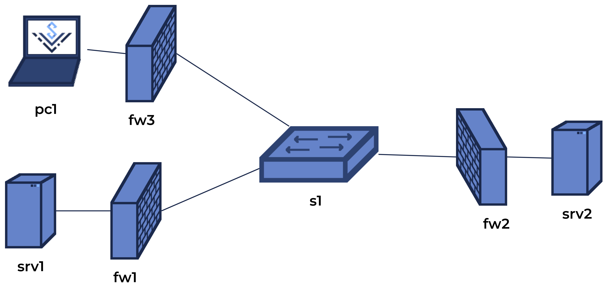

# Kurs DevOps Wakacyjnego Wyzwania KN Solvro 2026 - Lista 7

## Zadanie 0 - Przygotowanie środowiska

Za pomocą przestrzeni sieciowych utwórz sieć według poniższego schematu:

> [!NOTE]
> Dla ujednoznacznienia: Firewalle pełnią również rolę routera.

Każdej sieci lokalnej nadal unikatowy, prywatny adres sieci.
Przypisz urządzeniom adresację statycznie.
Ustaw odpowiednie sysctle w przestrzeniach.

`fw1` i `fw2` na razie skonfiguruj z pustą listą reguł i polityką `ACCEPT`.
Na `fw3` skonfiguruj NAT oraz blokowanie nawiązywania połączeń z zewnątrz.
Ustaw odpowiednie trasy tak, by wszystkie urządzenia mogły ze sobą się komunikować.
Nie ustawiaj tras na `fw1` i `fw2` do sieci prywatnej za `fw3` - `pc1` powinien móc komunikować się tylko przez NAT.

## Zadanie 1 - Konfiguracja Wireguard w modelu P2P

Włącz przechwytywanie pakietów na `s1` wiresharkiem.

Skonfiguruj VPN Wireguard między `srv1`, a `srv2`.
Przypisz uczestnikom unikatowe, prywatne adresy sieci, najlepiej z innego bloku adresowego niż w zadaniu 0.

Skonfiguruj klucze symetryczne dla połączenia.
Podaj każdemu uczestnikowi adres i port drugiego uczestnika.
Ustaw VPN tak, by nie wysyłał pustych pakietów w przypadku braku ruchu.

Przed wysłaniem jakichkolwiek danych przez VPN, sprawdź przechwycone wiresharkiem pakiety oraz stan interfejsów wireguard komendą `wg`.

Spróbuj wysłać pakiety poprzez VPN, np ping.
Przeanalizuj pakiety przesyłane siecią "fizyczną".
Zakończ przechwytywanie pakietów.

## Zadanie 2 - Wireguard vs firewall stanowy

Skonfiguruj `fw1` i `fw2` tak, by blokowały nawiązywanie połączeń z zewnątrz, z wyjątkiem pakietów ICMP oraz wybranego portu TCP.
Przetestuj działanie firewalla.

Włącz przechwytywanie pakietów na `s1` wiresharkiem.
Usuń interfejsy wireguard na `srv1` i `srv2`, zmień w konfiguracjach port do nasłuchu i utwórz interfejsy ponownie.
Spróbuj wysłać jakieś pakiety przez VPN.
Przeanalizuj zabserwowaną sytuację.

Usuń interfejsy wireguard, zmień ponownie w konfiguracjach port i włącz podtrzymywanie połączenia po obu stronach.
Uruchom ponownie przechwytywanie pakietów na `s1`.
Utwórz interfejsy i zaboserwuj pakiety przesyłane siecią "fizyczną" oraz stan interfejsów komendą `wg`.
Spróbuj przesyłać dane VPNem.
Zakończ przechwytywanie pakietów.

## Zadanie 3 - Wireguard vs NAT: konfiguracja w modelu client-server

Skonfiguruj kolejny VPN Wireguard, między `srv2`, a `pc1`.
`srv2` skonfiguruj jako serwer, a `pc1` jako klient.
Dodaj do `fw2` regułę zezwalającą na ruch przychodzący dla nowego VPNa.

Najpierw utwórz interfejs na `srv2` i sprawdź jego stan komendą `wg`.
Spróbuj przesyłać dane poprzez VPN do `pc1`.

Następnie utwórz interfejs na `pc1` i sprawdź stany obu interfejsów komendą `wg`.
Spróbuj przesyłać dane.

## Zadanie 4 - Łączenie VPNów

Skonfiguruj oba VPNy tak, by możliwe było przesyłanie między nimi danych poprzez `srv2`.
Spróbuj wysyłać dane między `srv1`, a `pc1`.
